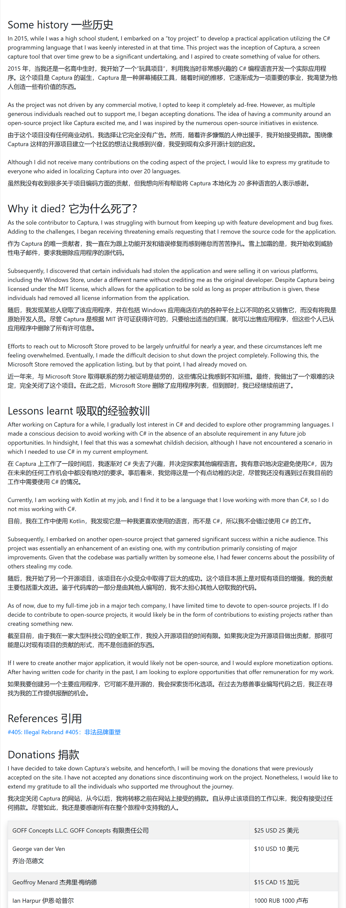

# 1. 互联网

- Ladybird ：全新独立开源浏览器

  https://github.com/goldmansachs/gs-quant

  https://ladybird.org/

  瑞典程序员Andreas Kling为了打发戒毒后无所事事的时光，他开始开发一套全新的操作系统：
  
  SerenityOS/宁静OS

  后来又从其中分离出浏览器引擎部分，计划基于此做一个全新、跨平台的开源浏览器，它没有来自其它浏览器的代码。
  
  2023年，电子商务公司Shopify向LadyBird捐款10万美元，支持LadyBird的开发

  Chris Wanstrath，GitHub联合创始人，捐赠100万美元，和Andreas一期推出了LadyBird浏览器计划，这是一家美国501(c)(3) 非营利组织。

  计划在 2026 夏天发布第一个 Alpha 版本。

  2024.7.10

## 1.1 网络废弃仓库

    互联网的精神是开放共享
    
    但就像原子弹之父的无奈
    
    很多伟大的事物一旦问世，就不可控了。

    中文互联网起步晚，本就底蕴浅薄，
    
    移动互联网普及后，就像后来很多社区的衰败，
    
    一旦扩张，门槛低了导致鱼龙混杂，搅成了一潭浑水。
    
    充斥着大量低质量、复制粘贴、无效的内容，
    
    以及为了商业利益毫无底线的广告
    
    垃圾内容的倾销

    蚕食着优质内容的领土

    短平快侵蚀着其他类型的内容

    很多优秀内容创作者自此销声匿迹，杳无音信

    如果去翻找就会发现，
    
    2016~2018年间大量的优质内容创作者不再发布新内容，
    
    甚至有的自2012、2013始。

    有的是被自私无知的败类伤透了心，
    
    也有为爱发电的人士疲于生计

    内容审查也从侧面推波助澜

    （ 说起内容审查的因素，对比GFW外面的世界就知道了，但是我看得少，并不知道英文互联网是否也在枯萎。
    但想必没有本质区别，从TikTok就可以管中窥豹）

    还有广大的开源项目维护者，
    
    他/她 们才是支撑起互联网的脊梁

    各个大厂自筑壁垒，
    
    打造自为神明的信息孤岛

    2024年AI更是爆炸性发展，
    
    又为封闭的互联网推波助澜

    互联网大厂为了自身利益以及长远发展，可恨？

    广大网民身被驱使而不自知，可怜？

    纵使大厂过了头，网民侵害版权何尝不是对网络健康的迫害？

    借用一篇文章标题的说法
    
    互联网是人类走过的一段弯路吗？

    2024年6月

扩展阅读：
>
> 1.互联网死了23%，这只是开始 – 虹线（2015-04-14）
https://1q43.blog/post/1927
>
> 2.互联网是人类历史的一段弯路吗？ – 虹线（2020-04-16）
https://1q43.blog/post/673
>
> 3.垄断的困境 – 虹线（2021-05-06）
https://1q43.blog/post/766
>
> 4.互联网与中国后现代性呓语 – 虹线（2022-04-18）
https://1q43.blog/post/782
>
> 5.【中文互联网正成为一座牢笼【智先生】】（2023-12-06 ） https://www.bilibili.com/video/BV1KC4y1R7NM/?share_source=copy_web&vd_source=e7e7b7b17da2a00765c198e1206fa900
>
> 6.互联网公司的管理神话破灭 – 虹线（2024-02-04）
https://1q43.blog/post/5187
>
> 7.何加盐｜中文互联网正在加速崩塌（2024-5-23）
https://project-gutenberg.github.io/Pincong/post/a5603ace66c80ee5e1f3d8417189df32/
>
> 8.世界需要重回资本主义 – 虹线（2024-06-11）
https://1q43.blog/post/5901
>
> 9.【谁才是杀死中文互联网的罪魁祸首？【丰言疯话】】（2024-05-26） https://www.bilibili.com/video/BV1ub421i7Hr/?share_source=copy_web&vd_source=e7e7b7b17da2a00765c198e1206fa900
>
> 10.🙏少读点书，多刷刷抖音吧 – 虹线（2024-06-18）
https://1q43.blog/post/2233

## 1.2 网盘

2024年6月3日21：00，百度封禁解析账号。

据相关人士透露，

    “现在搭建个解析站，实在太简单了，在 2023 年的时候还没那么多人干，2024 年后，直接迸发式增长，是个 Up 主都在 B 站等视频平台发自己搭建的解析站，这就导致大量流量走 Share 接口，百度赚不到钱，就改了接口，”

    “但是我对 2024 年如同雨后春笋般的解析站增长速度有点.. 不是说不好，但是这种增长对 Share 接口请求量加大，以及使百度失去了大量 SVIP 用户，他们都转向了解析，使百度赚不了钱，就只好封你接口，让用户回流，”

- PanDownload

  这是先驱吧？  
 ~~http://www.pandownload.com/~~    

- KinhDown    
  https://kinhdown.kinh.cc/

    

        
preview

        <image src="https://github.com/GiveStar/private-plot/assets/86779955/eea316b1-2f4d-4677-9b05-f8cb4315f22e">
    

        
    
- 雷鸟下载

  https://github.com/thunderbird-team/ThunderBird_OpenSource

  

    
preview

    <image src="https://github.com/GiveStar/private-plot/assets/86779955/174ce7ac-3e67-4b19-86d3-aa3da98ea95d">
  

    
  每天限量几G，开发者爱心发电，2020年底也撑不下去了，详情见issues 
    

- 就是加速
   
  https://api.94speed.com/
   
  

    
preview

    <image src="https://github.com/san-ren/private-plot/assets/86779955/3a561b0d-8235-4cf1-915d-d7d879ea4232">
  

   悄无声息的湮灭了，等到域名过期的那一天

- 阿里云盘第三方
  
  2024年5月底，用户下载线程受限，多线程需购买权益包，第三方软件丧失立足之基

  或停更、删库，或观望踌躇

  还有一些以阿里云盘做影视源的也是含恨而死
  
  新晋大厂网盘辉煌不再，当然，这一切都是必然

 
      

 > 吃水不忘挖井人    

## 1.3 影音

    网民的知识产权意识普遍比较淡薄

    但这不是平台和垄断方在产权意识刚刚起势之时就大肆收割的借口

    影视平台的广告、会员繁杂到让人望而却步

    这都是聪慧的国民的智慧结晶

    以至于看到奈菲、谷歌的广告

    都感觉是国内玩剩下的

    商业模式的迭代

    早已跨越赶超，甩开了十八条街

    甚至官媒都屡次发声批评

    但这只是经济发展的一朵水花

    很多产业的发展都是这样

    先任其野蛮发展

    成势、壮大之后再加以约束

    在我看来，这是最好的也是唯一的方法

    再看音乐平台的动作

    就显得那么不引人注目

    毕竟以榜单排名引诱丧失自我的粉丝竞买专辑的形式早已被叫停

    现如今消费者苦恼之处在于

    版权的分散

    拥有一家的会员并不能听到所有歌曲

    但这其实无可厚非、合情合理

    好像对于音乐、影视而言，商业意味更浓厚一些

    毕竟任何一个有道德的人，恐怕都无法大言不惭道：

    听歌看电影就应该开放共享

    国内某些方面的发展确实实现了当年“超英赶美”的口号

    毕竟在庞大的人口与消费市场所塑造的经济体量里

    商业发展如鱼得水

    中国接入国际互联网晚了太多

    互联网真正大众化普及还是靠的智能手机、移动互联网

    但正像没有完整经历过的人完全无法想象

    第一部Android智能手机

    仅仅发布于2008年10月

    那时候的安卓系统是何等的简陋

    2018年的安卓阵营又是何等的百花齐放

    中国互联网商业的发展的确称得上是

    伟大

    先模仿后超越

    这是亘古不变的超车真理

    2024年6月

- MusicLake

  https://github.com/caiyonglong/MusicLake/
    

          
preview

          <image src="https://github.com/san-ren/private-plot/assets/86779955/255f1991-abdf-4cb0-ac93-63155af6fed9"
    

- 歌词适配

    

            
preview

            <image src="https://github.com/san-ren/private-plot/assets/86779955/c815a952-d894-4a2f-a177-159c97bae181"
        

# 2. 理财

2023年5月接触理财，开始小额买入指数基金

在最高点买入，一脚踏进小股灾

2024年2月来到亏损最低点

所持有的4个基金亏损20%

剩下的三五个绿到10%

果然，苦难使人成长

大a的水很深哪，我把握不住

隔壁的纳斯达克ETF，成立不到2年涨了50%

每天在泡沫破裂的恐慌中上涨🤣

上市圈钱，退市走人

股票卖了几个亿，最后罚款几千万

搁我我也乐意干

一个个都在卖空壳公司

监管视而不见

助纣为虐否？

宏观调控的得失暂且不谈

此番行径，意欲何为？

2024.6月末

> 扩展：
>
> 1.【我将所有的基金知识浓缩到4分钟视频里了】（2020-02-16） https://www.bilibili.com/video/BV1P7411E7SG/?share_source=copy_web&vd_source=e7e7b7b17da2a00765c198e1206fa900
>
>  2.【耗时1月，查阅近百份资料，全网最牛复盘！足以载入史册的金融战争—GameStop游戏驿站（GME），散户大战华尔街事件始末】（2021-03-17） https://www.bilibili.com/video/BV1yf4y1s731/?share_source=copy_web&vd_source=e7e7b7b17da2a00765c198e1206fa900
>
>  3.【太燃了！散户vs华尔街世纪大战，一夜8次熔断，拔网线、禁止交易都用上了！】 （2021-01-30）
https://www.bilibili.com/video/BV1nX4y1N7UB
>
>  4.【滥用bug导致上交所官方回档、作废交易、公然掀桌？！万字详解327事件！】（2024-03-01） https://www.bilibili.com/video/BV1hF4m157nD/?share_source=copy_web&vd_source=e7e7b7b17da2a00765c198e1206fa900
>
>  5.【深度干货】万字复盘A股34年历史|A股历史复盘|价格闯关|股权分置改革|2008金融危机|2015大牛市|2020新冠危机 （2024-04-21）
https://www.bilibili.com/video/BV1TE421M7jm
>
>  6.【纪录片】A股史上最大股灾！全面回顾A股的6次股灾！股票投资必看！ （2024-05-03）
https://www.bilibili.com/video/BV1hD421P7tn
>

## 2024.7.6

下载安装体验各种软件

是自拥有了自己的电脑开始

持续了四五年的兴趣

说句大言不惭的话

用过的软件、网站成千上万

见证了很多。

我不在的时代，

只能在上帝视角看兴衰荣辱

我所处的时代，

我来体会牛鬼蛇神

人文社会已经发展到了人人逐利的阶段

科技社会已经容不下百花齐放、百家争鸣

法制社会的约束越来越紧

个人网站、个人开发者举步维艰

互联网的脊梁越来越弥足珍贵

我又看到了一颗星辰的陨落

天空逐渐黯淡。

- MathewSachin/Captura: Capture Screen, Audio, Cursor, Mouse Clicks and Keystrokes

    https://github.com/MathewSachin/Captura

      归档后还在持续增长star数目

      fork数量达到2k

      足以说明这是一个非常优秀的项目

      2024年能够聚合如此之多优秀功能的也很罕见

      被用户本地化为 20 多种语言

      怕是覆盖了地球大部分面积

      惜哉，哀哉

---
---
## 2024.7.14

其实我这样天天网上看个这看个那的

也没形成个工作流或者固定的流程

初始接触就是公众号里看见推荐软件的文章

就像一个圆

周长越大，触碰的外界越多

就这样用过了很多软件

一般官网都是固定的几个结构

撒一眼官网的质感

也能管中窥豹

可见软件的质量

这几天觉得需要个便签软件

但以前从没用过便签

唯一知道的就是系统的便笺

这是一类我从没接触过的东西

导致一开始看的都是剪贴板增强

边看剧边看软件

05年的，15年的

用过了几十个好的坏的、能打开的不能打开的

最后记下来15个便签/待办软件

最后突然意识到

这正是我很久没有经历的过程

无中生有

从零开始

长久以来

很多类的软件见过了太多的推荐

也用过了很多

以往记录的优秀软件

几年过后

多少个网站过期、跑路、买卖

优秀软件历经多年保持更新

看着长长的更新记录

沧海桑田

